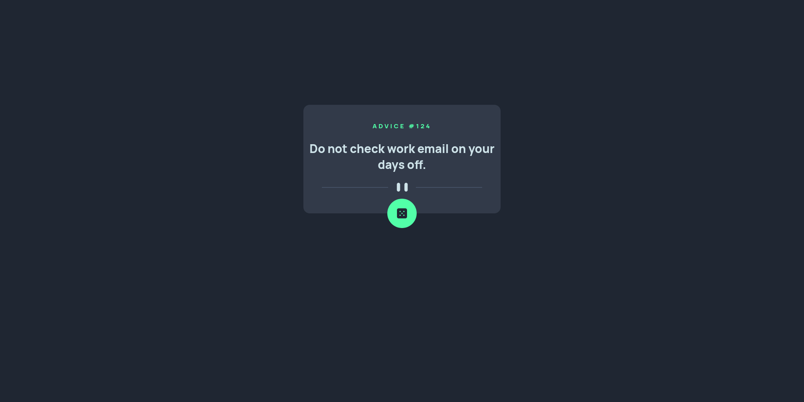

# Frontend Mentor - Advice generator app solution

This is a solution to the
[Advice generator app challenge on Frontend Mentor](https://www.frontendmentor.io/challenges/advice-generator-app-QdUG-13db).
Frontend Mentor challenges help you improve your coding skills by building
realistic projects.

## Table of contents

- [Overview](#overview)
  - [The challenge](#the-challenge)
  - [Screenshot](#screenshot)
- [My process](#my-process)
  - [Built with](#built-with)
  - [What I learned](#what-i-learned)
- [Acknowledgments](#acknowledgments)

## Overview

### The challenge

Users should be able to:

- View the optimal layout for the app depending on their device's screen size
- See hover states for all interactive elements on the page
- Generate a new piece of advice by clicking the dice icon

### Screenshot



## My process

### Built with

- HTML5 markup
- CSS properties
- Flexbox
- Mobile-first workflow
- Javascript

### What I learned

I learned how to use the 'fetch' function in JavaScript to make asynchronous
HTTP requests. This feature allows me to retrieve data from a server and handle
the response seamlessly in web applications. Below is a snippet demonstrating
the basic usage of 'fetch' to fetch data from an API.

```js
// Example using fetch to make a GET request to an API
fetch("https://api.example.com/data")
  .then((response) => {
    if (!response.ok) {
      throw new Error("Network response was not ok");
    }
    return response.json();
  })
  .then((data) => {
    // Handle the fetched data
    console.log("Fetched data:", data);
  })
  .catch((error) => {
    console.error("There was a problem with the fetch operation:", error);
  });
```

## Acknowledgments

- [Advice Slip API](https://api.adviceslip.com/)
